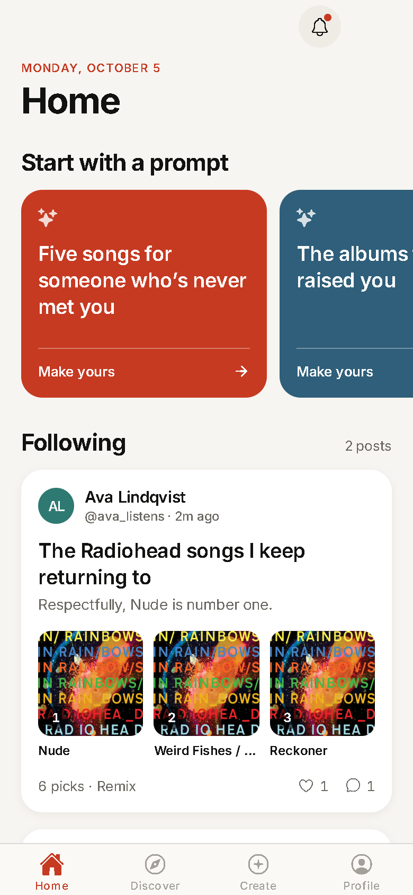
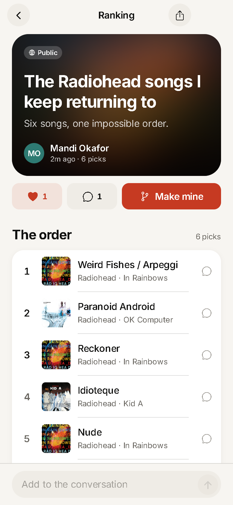
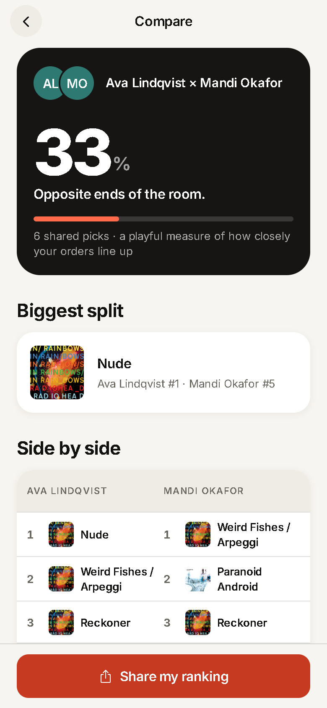
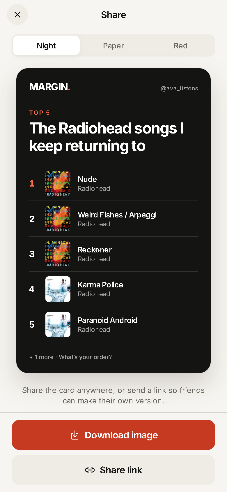
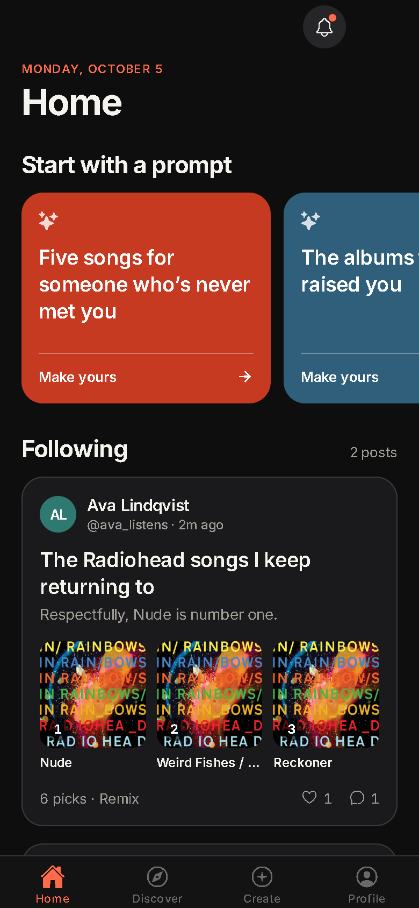
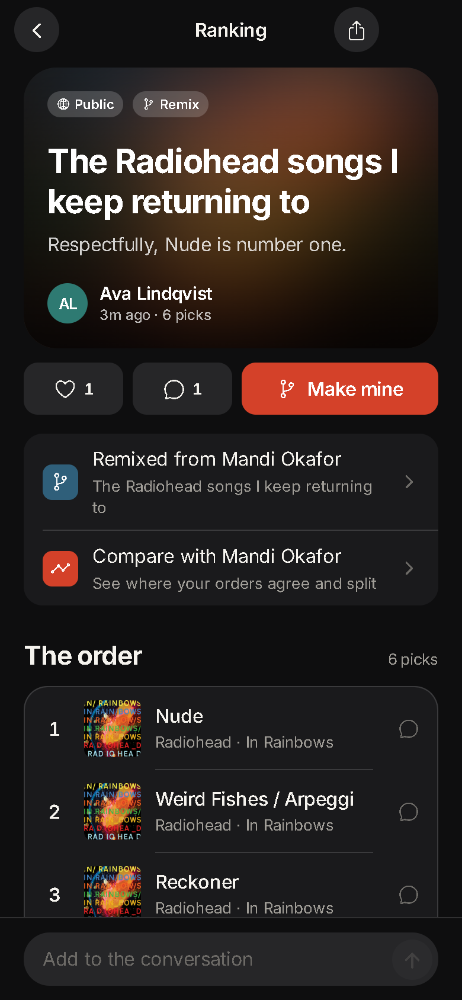
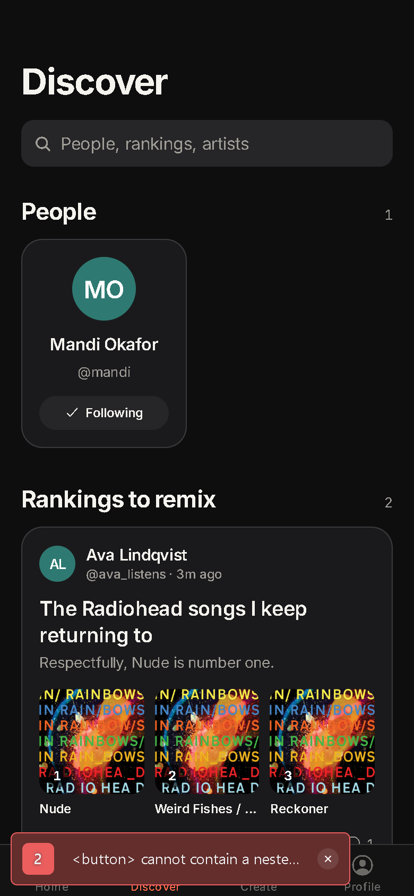
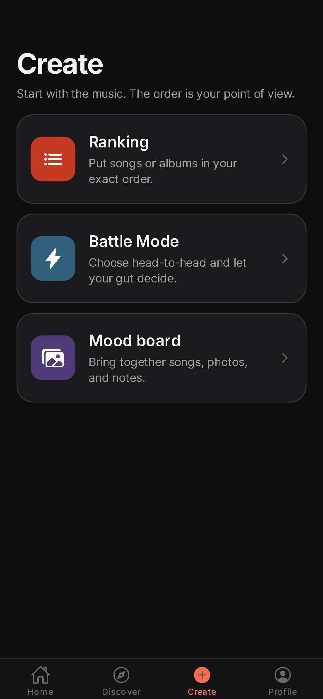

<div align="center">


# MARGIN

**Music, in your own order.**

Rank the songs and albums you love, remix your friends’ lists, and see exactly where your taste agrees — and where it splits.


<br />

&nbsp;
&nbsp;
&nbsp;


<br />

**[⬇ Download the latest Android APK](https://github.com/gaurangp22/spotlight/releases/latest)**

</div>

---

## Install on Android

1. On your phone, open the **[latest release](https://github.com/gaurangp22/spotlight/releases/latest)** and tap the `.apk` file under **Assets** to download it.
2. Open the downloaded file (from the notification, or **Files → Downloads**).
3. If Android asks, tap **Settings** and turn on **Allow from this source** for your browser or Files app, then go back.
4. Tap **Install**, then **Open**.

If Google Play Protect shows *“Unsafe app blocked”* or *“App scanned”*, tap **More details → Install anyway**. This appears for any app installed outside the Play Store.

**Updating:** download the newer APK from Releases and install it over the old one — your account and posts are kept on the server. **Requirements:** Android 7.0 or newer.

## Why MARGIN

Most music apps tell you what to listen to. MARGIN is about what you *think*. The core loop is simple:

1. **Rank** five songs, ten albums, or a whole playlist — by hand, or head-to-head in Battle Mode.
2. **Remix** a friend’s ranking into your own order with one tap.
3. **Compare** the two and get an agreement score, your biggest split, and a side-by-side view worth arguing about.
4. **Share** a designed card anywhere, or a link that respects your privacy settings.

## Features

| | |
|---|---|
| **Rankings** | Up to 100 unique songs or albums, reorderable, with title and context. Drafts autosave on the device. |
| **Battle Mode** | Shuffled head-to-head matchups decide the order; finish early at any time and fine-tune by hand. |
| **Remix & Compare** | “Make mine” copies a ranking into your draft. A Spearman-footrule score measures how closely shared picks line up. |
| **Mood boards** | Songs, photos, and notes on one of four colour stories. Photos are resized and compressed on the device. |
| **Social** | Follow people, agree with posts, comment on a post or on an individual pick, and get an in-app activity feed with unread badges. |
| **Privacy controls** | Public, followers-only, or private posts — enforced on the server, not just hidden in the UI. Block and report built in. |
| **Share cards** | Night, Paper, and Red templates exported as PNG through the native share sheet (or downloaded on web). |
| **Music sources** | Public catalog search works out of the box. Connect Spotify to search its catalog and import playlists. |
| **Account control** | Change password, password recovery by email, and full in-app account deletion. |

## Design

MARGIN is designed to feel at home next to first-party apps: large collapsing titles, inset grouped lists, spring-based press feedback, haptics on every meaningful action, and a full light and dark theme that follows the system.

<div align="center">
&nbsp;
&nbsp;
&nbsp;

</div>

- **Type:** Inter, on a single type scale modelled on platform text styles (`src/ui/theme.ts`).
- **Colour:** warm neutrals with one brand red. Every text/background pair is contrast-checked to WCAG AA in both themes.
- **Components:** one set of primitives (`src/ui/primitives.tsx`) — buttons, segmented controls, sheets, dialogs, list groups — so every screen behaves the same way.
- **Accessibility:** labelled controls, 44 pt minimum touch targets, Dynamic Type support with sensible caps, and screen-reader announcements for notices.

See [DESIGN.md](DESIGN.md) for tokens and principles.

## Architecture

```
┌──────────────────────────┐        HTTPS / JSON        ┌───────────────────────────┐
│  Expo app (src/)         │ ─────────────────────────▶ │  Node 24 API (server/)    │
│  Expo Router screens     │                            │  node:http, no framework  │
│  AppContext state        │ ◀───────────────────────── │  SQLite  ⇄  Turso libSQL  │
│  Drafts in AsyncStorage  │                            │  Spotify PKCE · Resend    │
│  Session in SecureStore  │                            │  /privacy /terms pages    │
└──────────────────────────┘                            └───────────────────────────┘
```

| Layer | Stack |
|---|---|
| App | Expo SDK 57, React Native 0.86, React 19, Expo Router (typed routes), Reanimated 4, expo-image, expo-haptics |
| API | Node 24 `node:http`, `node:sqlite` locally, `@libsql/client` for Turso, scrypt password hashing, AES-256-GCM token encryption |
| Tooling | TypeScript (strict), ESLint (`eslint-config-expo` + React Compiler rules), `node:test`, EAS Build |

## Getting started

**Requirements:** Node 24+, npm, and for native builds Android Studio (SDK 36, JDK 21) or an [Expo account](https://expo.dev) for cloud builds.

```bash
npm ci
npm --prefix server ci
npm run api            # API on http://localhost:8787 — keep this running
```

In a second terminal:

```bash
npm start              # Expo dev server (Android dev build / emulator)
npm run web            # or run in the browser at http://localhost:8081
```

Visitors see clearly labelled example rankings; signed-in feeds show real posts. To test social features, create two accounts in separate browser profiles.

The local database and the auto-generated token encryption key live in `server/data/` (git-ignored). Back up both.

### Running on an Android phone

Keep the phone and computer on the same Wi-Fi. Development discovers the Metro host automatically; if it can’t, copy `.env.example` to `.env`, set `EXPO_PUBLIC_API_URL=http://YOUR_LAN_IP:8787`, and restart Metro. Allow inbound connections on ports 8787 and 8081.

MARGIN uses native modules (haptics, secure storage, image picking), so use a development build rather than Expo Go: `npm run android` with Android Studio installed, or `npx eas-cli@latest build --profile development`.

<details>
<summary><b>Building a local test APK on Windows</b></summary>

```powershell
$env:MARGIN_LOCAL_PREVIEW='1'
$env:EXPO_PUBLIC_API_URL='http://YOUR_LAN_IP:8787'
$env:JAVA_HOME='C:/Program Files/Android/Android Studio/jbr'
$env:ANDROID_HOME="$env:LOCALAPPDATA/Android/Sdk"
npx expo prebuild --platform android --clean --no-install
Set-Location android
./gradlew.bat assembleRelease --no-daemon
```

Output: `android/app/build/outputs/apk/release/app-release.apk`. This APK allows plain HTTP, embeds your computer’s address, and is signed with a test key — it is for local testing only.

If an older Windows SDK hits Ninja’s path-length limit, install [Ninja 1.12+](https://github.com/ninja-build/ninja/releases) and set `MARGIN_NINJA_PATH` to its executable before prebuild.

</details>

## Configuration

### App (`.env`, public values only)

| Variable | Needed? | What it is / where to get it |
|---|---|---|
| `EXPO_PUBLIC_API_URL` | **Yes, for any APK others use** | The HTTPS address of your deployed API, e.g. `https://margin-api.onrender.com`. You get it from your host after [deploying the API](#deploying-the-api). |
| `EXPO_PUBLIC_SUPPORT_EMAIL` | Recommended | Any inbox you check. Shown as “Contact support” in Settings. |
| `EXPO_PUBLIC_WEB_URL` | Optional | Only if you host the web version; shared links then open in a browser. |

> Anything prefixed `EXPO_PUBLIC_` is bundled into the app. Never put secrets here.

### API (`server/.env`, never shipped to the app)

| Variable | Needed? | What it is / where to get it |
|---|---|---|
| `NODE_ENV` | **Yes** | Type `production`. |
| `TOKEN_ENCRYPTION_KEY` | **Yes** | Generate once with `node -e "console.log(require('crypto').randomBytes(32).toString('hex'))"`. Never change it afterwards, or saved Spotify connections stop working. |
| `TURSO_DATABASE_URL` | **Yes, when hosted** | [turso.tech](https://turso.tech) → sign up → **Create database** → copy its URL (`libsql://…`). Tables are created automatically on first start. Leave blank to use a local SQLite file instead. |
| `TURSO_AUTH_TOKEN` | **Yes, when hosted** | Turso dashboard → your database → **Create token**. |
| `PUBLIC_API_URL`, `WEB_APP_URL`, `ALLOWED_ORIGINS` | Public API URL, web app URL (for password reset links), and allowed browser origins. |
| `SPOTIFY_CLIENT_ID`, `SPOTIFY_REDIRECT_URI` | Optional | [developer.spotify.com/dashboard](https://developer.spotify.com/dashboard) → **Create app** → set the redirect URI to `https://YOUR-API/api/spotify/callback` → copy the Client ID. Without it, catalog search still works. |
| `RESEND_API_KEY`, `EMAIL_FROM` | Optional | [resend.com](https://resend.com) → **API Keys**. `EMAIL_FROM` must use a domain you verify there. Enables “Forgot password”. |
| `ADMIN_TOKEN` | Optional | Any random string of 32+ characters. Enables the moderation commands. |
| `TRUSTED_PROXY_IPS` | Reverse proxy addresses whose `X-Forwarded-For` is trusted for rate limiting. |

Spotify notes: phones need an HTTPS callback reachable from their browser; web testing can use a `127.0.0.1` loopback callback (Spotify rejects `localhost`). New Spotify apps start in development mode with limited users — see [quota modes](https://developer.spotify.com/documentation/web-api/concepts/quota-modes).

## Quality

```bash
npm run typecheck      # tsc --noEmit (strict, typed routes)
npm run lint           # ESLint incl. React Compiler rules
npm test               # comparison logic + API integration tests
npx expo install --check
```

The API suite covers accounts and sessions, privacy enforcement across reads/feeds/writes, blocks, reactions and comments, reports and moderation, password recovery, SQLite persistence, mocked Spotify PKCE and token refresh, profile counts, and the public store pages.

## Releasing

MARGIN ships with [EAS](https://docs.expo.dev/eas/) profiles in `eas.json` (`development`, `preview`, `production`). Production builds produce an Android App Bundle with remotely managed, auto-incrementing build numbers.

```bash
npx eas-cli@latest init                                   # link the project once
npx eas-cli@latest env:create --environment production --name EXPO_PUBLIC_API_URL --value https://api.your-domain.com
npx eas-cli@latest build --platform android --profile production
npx eas-cli@latest submit --platform android --profile production   # uploads to the internal track as a draft
```

### Publishing an APK on GitHub Releases

An APK only works if it points at an API that is online over HTTPS — [deploy the API](#deploying-the-api) first.

```bash
npx eas-cli@latest login
npx eas-cli@latest init
npx eas-cli@latest env:create --environment preview --name EXPO_PUBLIC_API_URL --value https://YOUR-API --visibility plaintext
npx eas-cli@latest build --platform android --profile preview
```

When the build finishes, download the `.apk` from the link EAS prints. Then on GitHub:

1. Open the repository → **Releases** → **Draft a new release**.
2. **Choose a tag** → type a version such as `v1.0.0` → **Create new tag**.
3. Title it (e.g. `MARGIN 1.0.0`) and list what’s new.
4. Drag the `.apk` into **Attach binaries**, rename it something clear like `MARGIN-1.0.0.apk`, and click **Publish release**.

The download link at the top of this README always points to the newest release. For each update, bump `version` in `app.json` (EAS increases the Android build number automatically) and publish a new release.

### Store readiness

The API serves the pages store listings require — point the console at your API domain:

| Requirement | URL |
|---|---|
| Privacy policy | `https://api.your-domain.com/privacy` |
| Terms of service | `https://api.your-domain.com/terms` |
| Account deletion | `https://api.your-domain.com/delete-account` |

The same text appears in-app under **Settings → About**, sourced from one file: `server/legal.json`. **Have it reviewed** and add your legal entity name and support contact before publishing.

Already handled: in-app account deletion, no ads or third-party tracking, minimal Android permissions (no camera, microphone, overlay, or broad media access — photos use the system picker), `ITSAppUsesNonExemptEncryption=false` for iOS, light/dark splash screens, and adaptive + monochrome Android icons.

Still yours to do: create the store listings and screenshots, complete the Play **Data safety** form (account info, user content, and photos are collected; nothing is shared or sold; data is encrypted in transit; users can request deletion), set the content rating, run native QA on real devices, and apply for Spotify’s extended quota if you need more users than development mode allows.

## Deploying the API

`server/Dockerfile`, `server/compose.yaml`, and `server/Caddyfile.example` give you a production starting point: a non-root Node 24 container with a health check, a persistent data volume, and Caddy for automatic HTTPS.

```bash
cd server
cp .env.example .env      # fill in production values
docker compose up -d --build
```

### Moderation

With `ADMIN_TOKEN` set, from `server/`:

```bash
node --env-file=.env admin.mjs reports            # list open reports
node --env-file=.env admin.mjs dismiss REPORT_ID  # keep the post
node --env-file=.env admin.mjs remove REPORT_ID   # delete the post
```

## Project structure

```
src/
  app/            Expo Router screens — (tabs), ranking/[id], builder, battle, compare, share, legal, …
  store/          AppContext: session, API sync, device drafts, unread activity
  lib/            API client, music search, comparison maths, links, types
  ui/             Design system — theme tokens, primitives, screen scaffold, music picker
server/
  api.mjs         Routes, validation, privacy rules
  db.mjs          SQLite / Turso adapter       schema.sql   Tables and indexes
  security.mjs    Hashing, encryption, input checks
  spotify.mjs     PKCE flow, token refresh, playlist paging
  pages.mjs       Public privacy / terms / account-deletion pages (from legal.json)
  test/           node:test integration suite
assets/           App icon, adaptive icon layers, splash marks
docs/screenshots/ README imagery
```

## Security & privacy

- Passwords hashed with scrypt; sessions are random 256-bit tokens stored only as SHA-256 digests, kept in the device keychain/keystore.
- Spotify tokens encrypted at rest with AES-256-GCM.
- Visibility and blocks are enforced in SQL on every read path; validation on every write.
- Rate limiting on authentication, recovery, and global request volume; strict CORS allow-list; `nosniff`, `no-referrer`, and `no-store` headers.
- No analytics SDKs, ads, or third-party trackers.

## Known limitations

- Feeds load the latest 200 accessible posts and discovery the latest 100 people; larger communities need pagination.
- Mood board photos are stored inline in the database; move them to object storage before scaling.
- Push notifications aren’t implemented — activity is in-app only.
- MARGIN doesn’t stream music, and doesn’t integrate with Apple Music.

## License

No open-source license has been granted. All rights reserved by the project owner.
